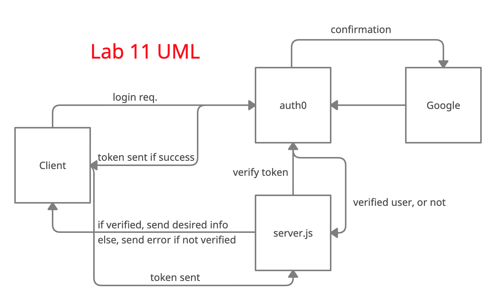
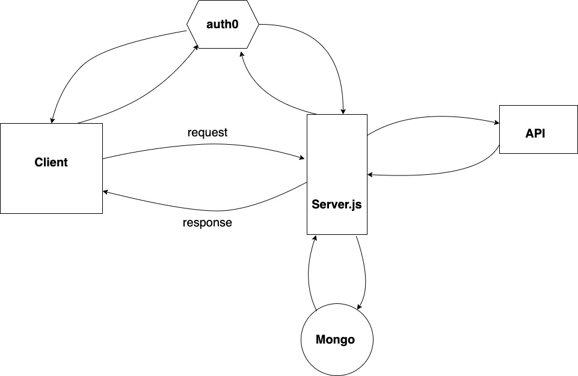

# Start your own "Can of Books" App

This repository has starter code to begin work on creating your own online bookshelf.

## What can books do?

Books are life-changing. They have the power to enlighten, educate, entertain, heal, and help us grow. Build out this code base to create an web app to track what books have impacted you, and what's recommended to read next.

## Use this template

Clone this repo to your own account with the green "Use this template" button. Then, add any collaborators. Now you are ready to start adding features! Deploy your site to let the world know which books have had the greatest impact on you, and what's recommended. Enjoy!

---

# Project Name

**Author**: Clarissa P and Mark T
**Version**: 1.1.0 (increment the patch/fix version number if you make more commits past your first submission)

## Overview

As a user, I'd like to sign in with OAuth, so that I can authenticate to the site without creating yet-another username/password combo to potentially get hacked or lost.

As a user, I'd like my books to persist, so that whenever I make changes, I can see the my full list of best books.

As a user, I'd like to see my list of books, so that I can track what's impacted me, and what's recommended to me.

As a user, I'd like to add a new book to my shelf, so that I can keep my lists up to date with my latest books and recommendations.

As a user, I want to remove books from my list, so that only the most important books are on my shelf.

As a user, I want to update book details on my list, so that I can change the book status, or update the book details as I learn more about it.

## Getting Started

<!-- What are the steps that a user must take in order to build this app on their own machine and get it running? -->

## Architecture

JavaScript  
Trello  
React  
Axios
AuthO  
Mongoose

<!-- Provide a detailed description of the application design. What technologies (languages, libraries, etc) you're using, and any other relevant design information. -->

## Credit and Collaborations

Mark Thanadabouth
JP Jones
Michael Ecleava

Auth0 Docs

---

***Logistical***

**What hours will you be available to communicate?**

1pm - 10pm

**What platform will you use to communicate (ie. Slack, phone …)?**

Slack

**How often will you take breaks?**

One hour ten minute rule

**What is your plan if you start to fall behind?**

Ask for help

***Cooperative***

**Make a list of each person’s strengths.**

Mark- Disciplined

Clarissa- 

We will figure them out

**How can you best utilize these strengths in the development of your application?**

**In what areas do you each want to develop greater strength?**

**Knowing that every person in your team needs to understand the code, how do you plan to approach the day-to-day development?**

***Conflict Resolution***

**What will your team do if one person is pulling all the weight while the other person is not contributing?**

Communicate, speak up

**What will your team do if one person is taking over the project and not letting the other member contribute?**

This will be limited by our communication tactic and having a safe space to speak up

**How will you approach each other and the challenge of building an application knowing that it is impossible for two people to be at the exact same place in understanding and skill level?**

Utilizing resources and communicating when we need them, then timeboxing when needed

---

Name of feature: Lab 11 User Authentication with Auth0

In this lab, we are going to begin with front-end React starter code and use a service called Auth0 that will handle most of the challenges of working with external identity providers. Your job will be to create a componentized React application where users can sign in via the Auth0 service. This service will give you a jsonwebtoken or JWT.

Once you have that hooked up, you will send that JWT (that essentially says that you are who you say you are) to a back-end. You will have server-side starter code to use as well. You will use a library call jsonwebtoken to open the JWT and it will verify whether it is valid.

Estimate of time needed to complete: 5 hours

Start time: 8/14 3 hours

Finish time: 8/18

Actual time needed to complete: 6 hours

---

Name of feature: Lab 12

Estimate of time needed to complete: 4 hours

Start time: 8/18 1 hour

Finish time: _____

Actual time needed to complete: _____

---

Name of feature: Lab 13
Today you will add the functionality for the user to add a book or delete a book. A book will be created with a form in React, and sent to the server where it will be saved into the database, and then returned to the front end to be displayed in the list of favorite books. You will then be able to delete that book with a click of a button, to have it instantly removed from the front end, and a request sent to back end for removal.

Estimate of time needed to complete: 4 hours

Start time: 8/21 

Finish time: 8/22

Actual time needed to complete: 6 hours